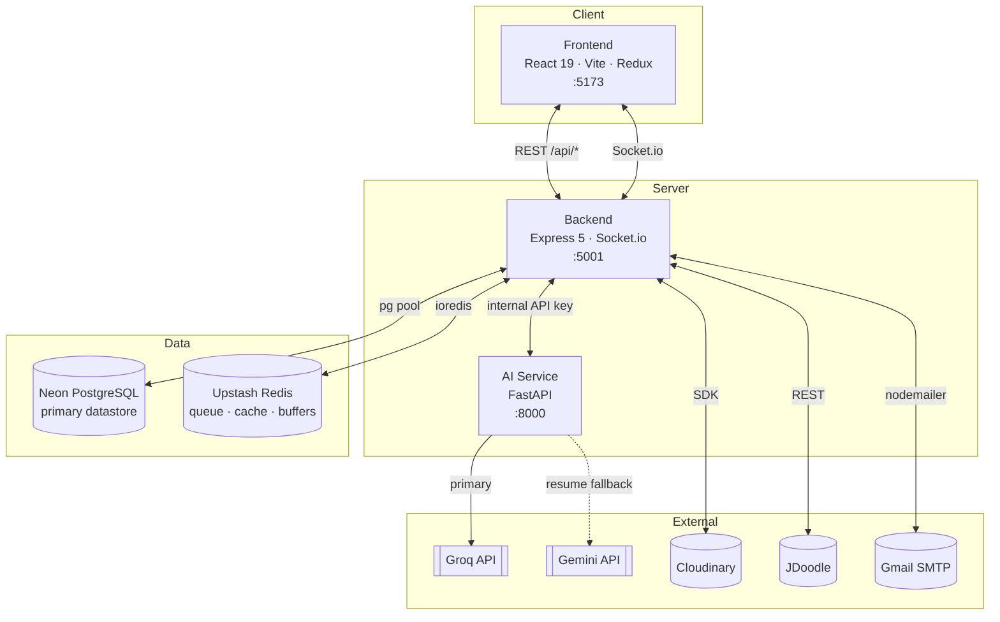
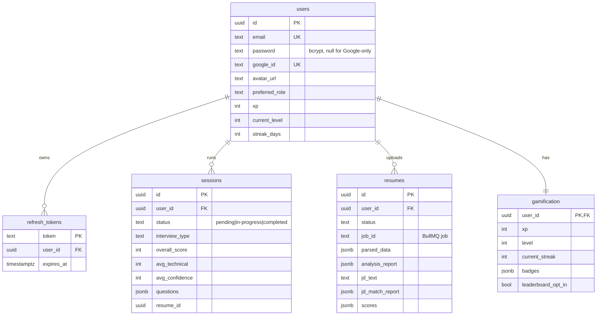
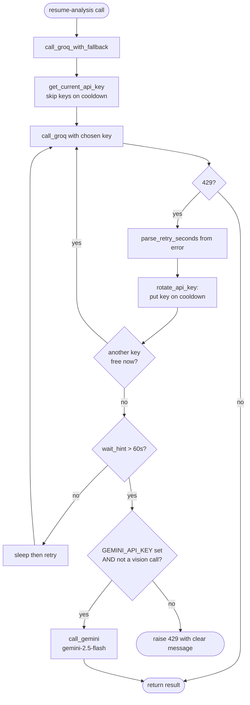

# TechVera — Architecture

> This upstream overview has been rebranded. For verified behavior, limitations, and API contracts, use [the Phase 0 current architecture](../docs/architecture-current.md).

This document is a deep dive into how TechVera is built: the services, the data model, the message flows, and the design decisions behind them. Every flow below reflects the actual code paths in the repository. It is written for a developer who wants to understand the system well enough to extend it.

## Table of Contents

1. [System Overview](#1-system-overview)
2. [Technology Choices](#2-technology-choices)
3. [Data Model](#3-data-model)
4. [Backend Internals](#4-backend-internals)
5. [AI Service Internals](#5-ai-service-internals)
6. [Frontend Internals](#6-frontend-internals)
7. [Flow: Authentication](#7-flow-authentication)
8. [Flow: Interview Session](#8-flow-interview-session)
9. [Flow: Resume Analysis Pipeline](#9-flow-resume-analysis-pipeline)
10. [Flow: AI Provider Rotation and Fallback](#10-flow-ai-provider-rotation-and-fallback)
11. [Real-Time Layer](#11-real-time-layer)
12. [Directory Reference](#12-directory-reference)

---

## 1. System Overview

TechVera is composed of three independently deployable services and a serverless data tier. The browser only ever talks to the backend; the AI service sits behind it and is reachable only with a shared internal key.



**Boundary rule:** model credentials and quota never reach the browser. The frontend requests, say, an answer evaluation from the backend; the backend calls the AI service; the AI service calls Groq. This single choke point is what makes server-side quota protection, key rotation, and the Gemini fallback possible.

---

## 2. Technology Choices

| Layer | Choice | Why |
|---|---|---|
| Frontend | React 19 + Vite + Redux Toolkit | Fast dev loop, predictable state for a multi-step interview UI |
| Backend | Express 5 + TypeScript | Long-lived process needed for WebSockets and background workers |
| AI Service | FastAPI (Python) | The AI/ML ecosystem (PDF parsing, OCR, provider SDKs) is Python-native |
| Primary DB | Neon PostgreSQL | Serverless Postgres; relational integrity with JSONB flexibility |
| Secondary store | Upstash Redis | Serverless Redis for queues, caches, and short-lived tokens |
| Realtime | Socket.io | Room-per-user push for live interview and resume updates |
| Media | Cloudinary | Off-loads whiteboard diagrams and profile photos |
| Code execution | JDoodle | Sandboxed multi-language execution for coding rounds |

The backend and AI service are split because they have different runtimes and scaling profiles: the backend is I/O-bound orchestration, while the AI service is request-heavy inference that benefits from Python libraries.

---

## 3. Data Model

Neon PostgreSQL is the single source of truth. The schema is created and migrated on backend startup — `CREATE TABLE IF NOT EXISTS` plus additive `ALTER TABLE ... ADD COLUMN IF NOT EXISTS` — so deploying a new version needs no manual migration step.



Design decisions:

- **JSONB for evolving shapes.** `questions`, `parsed_data`, and `analysis_report` change shape as features grow, so they are JSONB rather than dozens of columns. Relational fields (scores, status, foreign keys) stay as typed columns for indexing and integrity.
- **Partial index for the leaderboard.** `idx_gamification_xp` indexes `xp DESC` **only** `WHERE leaderboard_opt_in = true`. The ranking query stays fast and opted-out users are excluded at the index level.
- **Cascade deletes.** Every child table references `users(id) ON DELETE CASCADE`, so deleting an account removes all its sessions, resumes, tokens, and gamification data in one step.
- **Composite indexes for list views.** `sessions(user_id, created_at DESC)` and `sessions(user_id, status)` back the dashboard history and filters without full scans.

### Redis: what lives where (and why it is not Postgres)

Redis holds only fast-moving or expiring state; losing it never corrupts durable data.

| Key pattern | Contents | TTL |
|---|---|---|
| `bull:resume-processing:*` | BullMQ job queue for resume analysis | managed by BullMQ |
| `resume-view:{id}` | Cached rendered resume payload | short |
| `pending-reg:{email}` | Pending registration + hashed OTP | ~10 min |
| `otp-cooldown:{email}` | Resend cooldown guard | 60 s |
| `pwd-reset:{tokenHash}` | Password-reset token | ~15 min |
| XP buffer | XP earned mid-interview, flushed to Postgres at the end | session-scoped |

---

## 4. Backend Internals

```
backend/
├── config/          db pool (Neon), Redis client, Cloudinary
├── middleware/      protect (JWT), validation, rate limiters, file uploads
├── models/          SQL repositories — the ONLY layer that writes SQL
├── controllers/     thin HTTP handlers, one file per domain
├── routes/          route tables (user, session, resume, code, diagram, gamification, analytics)
├── services/        business logic
│   └── queue/       BullMQ worker + resume pipeline steps
├── types/ · utils/  shared types and helpers
└── uploads/         transient audio/resume files
```

**Repository pattern.** Controllers never touch SQL. Each model exposes a repository (`userRepository`, `sessionRepository`, `resumeRepository`, `gamificationRepository`, `refreshTokenRepository`) that runs the queries and maps rows to camelCase domain objects with `_id` and ISO timestamps. Because the interface is stable, the datastore could be swapped underneath without changing any controller.

**Service responsibilities.**

| Service | Responsibility |
|---|---|
| `sessionService` | The interview brain: create session, evaluate answers asynchronously, compute speech metrics, decide follow-ups, produce the score summary |
| `aiService` | Typed client to the AI service (`generateQuestions`, `transcribeAudio`, `evaluateAnswer`, `generateFollowUp`, `synthesizeSpeech`, `analyzeSpeech`) |
| `gamificationService` | XP awards, level thresholds, streaks, badge unlocks |
| `emailService` | Nodemailer transport with dark-themed templates; console fallback in dev |
| `socketService` | `pushSocketUpdate` (interview) and `emitResumeStatus` (resume) into the user's room |
| `queue/*` | BullMQ worker and the four-step resume pipeline |

**Concurrency safety.** Answers are evaluated asynchronously and follow-ups are appended to the same session document, so `sessionService` guards mutations with an in-process `withSessionLock` mutex to avoid lost updates when two operations race on one session.

---

## 5. AI Service Internals

The AI service exposes three route groups, all guarded by `verify_api_key`:

```
ai-service/app/
├── api/
│   ├── interview.py     /generate-questions · /generate-followup · /evaluate · /transcribe
│   ├── speech.py        /speech/*  (TTS for Ava)
│   └── v2/resume.py     /process · /analyze · /insights · /match · /rewrite-bullet
│                        /generate-cover-letter · /stream-* (SSE variants)
└── services/
    ├── groq_service.py            provider client · key rotation · Gemini fallback
    ├── whisper_service.py         audio → text
    ├── speech_analysis_service.py pace, filler words, pauses, clarity
    ├── resume_orchestrator_service.py
    ├── extraction/                file parsing + OCR
    ├── analysis/                  parsing, scoring, insights, feedback
    ├── matching/                  JD analysis + resume matching
    └── generation/                bullet rewrites, cover letters
```

**Models by task:**

| Task | Model |
|---|---|
| Questions, evaluation, follow-ups, resume analysis | `llama-3.3-70b-versatile` |
| Whiteboard diagram evaluation (vision) | `meta-llama/llama-4-scout-17b-16e-instruct` |
| Speech-to-text | `whisper-large-v3-turbo` |
| Ava's voice (text-to-speech) | `canopylabs/orpheus-v1-english`, voice `autumn` |

`groq_service.py` is the heart of the service: it resolves an available API key per attempt, applies cooldowns on rate limits, and provides `call_groq_with_fallback`, which the twelve resume-analysis modules import instead of `call_groq`. See [section 10](#10-flow-ai-provider-rotation-and-fallback) for the full logic.

---

## 6. Frontend Internals

```
frontend/src/
├── app/          Redux store
├── pages/        Landing · Login · Register · Forgot/Reset · Dashboard
│                 InterviewRunner · SessionReview · ResumeAnalyzer · AnalyticsDashboard
├── features/     domain slices + components (auth · session · resume · gamification · analytics)
├── components/   Ava avatar, interviewer panel, modals, header
├── hooks/        useSocket, useInterviewerVoice, useResumeAnalysis
└── services/     API clients + axios interceptor
```

State lives in four Redux Toolkit slices — `auth`, `session`, `gamification`, `analytics`. Real-time events are dispatched into these slices, so the UI updates without polling.

Three client systems worth calling out:

- **Ava lip-sync.** `useInterviewerVoice` fetches synthesized audio from `POST /:id/speak`, decodes it through a WebAudio `AnalyserNode`, and drives the avatar's mouth from the live RMS amplitude. If TTS is unavailable it falls back to the browser's `speechSynthesis` with simulated amplitude.
- **Refresh-resilient recording.** Per-question audio and code drafts are stored in IndexedDB, so a mid-interview refresh loses nothing.
- **Silent token refresh.** An axios response interceptor catches a `401`, calls `POST /user/refresh` once, and replays the original request. Auth endpoints (login, register, refresh, OTP) are excluded, so a wrong password fails immediately instead of triggering a pointless refresh round-trip.

---

## 7. Flow: Authentication

Registration is a two-step, OTP-verified process. The account is not created until the OTP is confirmed, so unverified emails never become rows.

```mermaid
sequenceDiagram
    autonumber
    participant U as User
    participant FE as Frontend
    participant BE as Backend
    participant RD as Redis
    participant M as Gmail SMTP
    participant PG as Postgres

    Note over U,PG: Registration (email + password)
    U->>FE: submit name, email, password
    FE->>BE: POST /api/user/register
    BE->>BE: hash password (bcrypt), generate 6-digit OTP
    BE->>RD: SET pending-reg:{email} = {name, passwordHash, otpHash} (TTL 10m)
    BE->>M: send OTP email
    BE-->>FE: { requiresVerification: true, email }
    FE->>U: show OTP screen (60s resend timer)

    U->>FE: enter OTP
    FE->>BE: POST /api/user/verify-otp
    BE->>RD: GET pending-reg:{email}; compare otpHash (max 5 attempts)
    alt OTP valid
        BE->>PG: INSERT user
        BE->>PG: INSERT refresh_token (rotating)
        BE-->>FE: Set-Cookie jwt (HttpOnly) + refresh; user object
        FE->>U: redirect to dashboard
    else invalid / expired
        BE-->>FE: 400 error (attempts decremented)
    end
```

Related paths that share this machinery:

- **Login** (`POST /user/login`) verifies the bcrypt hash and issues the same cookie pair.
- **Google login** (`POST /user/google`) verifies the Google ID token and stores `picture` as `avatar_url`. **Account linking:** if the Google email matches an existing email account, both resolve to the same `users` row, so history is unified rather than duplicated.
- **Token refresh** (`POST /user/refresh`) validates the refresh token in Postgres, rotates it, and issues a fresh access cookie.
- **Password reset** (`forgot-password` / `reset-password`) stores a hashed reset token in Redis and revokes all refresh tokens on success, logging out other sessions.

---

## 8. Flow: Interview Session

This is the most involved flow. The key idea: **answer submission returns immediately**, and transcription, evaluation, speech analysis, and any follow-up run asynchronously, pushing results to the client over Socket.io.

```mermaid
sequenceDiagram
    autonumber
    participant FE as Frontend
    participant BE as Backend (sessionService)
    participant AI as AI Service
    participant PG as Postgres
    participant WS as Socket.io

    Note over FE,PG: Create
    FE->>BE: POST /api/sessions (role, level, type, resume?)
    BE->>AI: POST /generate-questions
    AI-->>BE: question set
    BE->>PG: INSERT session (status=in-progress, questions JSONB)
    BE-->>FE: session

    loop for each question
        Note over FE,AI: Ava speaks (server reads text by index)
        FE->>BE: POST /:id/speak { questionIndex }
        BE->>AI: synthesizeSpeech(questionText)
        AI-->>BE: audio (Orpheus TTS)
        BE-->>FE: audio buffer → lip-synced playback

        Note over FE,WS: Candidate answers
        FE->>BE: POST /:id/submit-answer (audio, code?, diagram?)
        BE-->>FE: 200 "Answer received"  %% returns immediately

        Note over BE,WS: async: evaluateAnswerAsync()
        BE->>AI: transcribeAudio (Whisper)
        AI-->>BE: transcript
        BE->>AI: analyzeSpeech (pace, fillers, pauses)
        AI-->>BE: speech metrics → clarityScore
        BE->>AI: evaluateAnswer
        AI-->>BE: technical_score, confidence, feedback, ideal_answer
        BE->>PG: persist answer + metrics
        BE->>BE: gamificationService.addXP("question_answered")

        alt technical_score < 60 AND follow-ups < 2 AND not already a follow-up
            BE->>WS: sessionUpdate {status: "AI_FOLLOWUP", "preparing a follow-up..."}
            BE->>AI: generateFollowUp
            AI-->>BE: probing question
            BE->>PG: append follow-up (withSessionLock)
            BE->>WS: sessionUpdate {session with new follow-up}
        end
    end

    Note over FE,PG: End
    FE->>BE: POST /:id/end
    BE->>PG: compute overall/technical/confidence summary; flush XP
    BE-->>FE: final session → SessionReview + Report Card PDF
```

Details behind the diagram:

- **Quota protection.** `/:id/speak` takes only a `questionIndex`; the backend looks up the question text server-side, so a client cannot synthesize arbitrary text through the Groq TTS quota.
- **Speech metrics.** From the Whisper analysis the backend computes `speakingPaceWpm` (rated Slow / Good / Fast), `fillerWordCount`, `pauseCount`, `totalPauseDurationMs`, and a derived `clarityScore = 100 − fillerPenalty − pausePenalty`.
- **Follow-up rules.** Thresholds live in `sessionService`: `FOLLOWUP_SCORE_THRESHOLD = 60`, `MAX_FOLLOWUPS_PER_SESSION = 2`. A follow-up is never generated for an answer that is itself a follow-up. The append is done under `withSessionLock` to prevent races with a concurrent evaluation.
- **Coding and whiteboard rounds.** Code is executed via JDoodle; whiteboard diagrams are uploaded to Cloudinary and scored by the vision model.
- **Ending safety.** `endSession` refuses to finalize while answers are still transcribing or evaluating, so no score is computed on incomplete data.

---

## 9. Flow: Resume Analysis Pipeline

Resume analysis is asynchronous and modeled as a BullMQ state machine, so a slow multi-step analysis never blocks the upload request. Each step advances the resume's `status` and emits a `resume:status` event for a live progress bar.

```mermaid
sequenceDiagram
    autonumber
    participant FE as Frontend
    participant BE as Backend
    participant Q as BullMQ (Redis)
    participant W as Resume Worker
    participant AI as AI Service
    participant PG as Postgres
    participant WS as Socket.io

    FE->>BE: POST /api/resume/upload (file, jd?)
    BE->>PG: INSERT resume (status=pending)
    BE->>Q: enqueue job { resumeId }
    BE-->>FE: 202 accepted { resumeId }

    Q->>W: dispatch job
    W->>AI: stepProcess — parse + OCR text
    W->>PG: status=processing
    W->>WS: resume:status(processing)

    W->>AI: stepAnalyze — ATS score, skills, strengths/gaps
    W->>PG: status=analyzing; save analysis_report
    W->>WS: resume:status(analyzing)

    opt JD provided
        W->>AI: stepMatch — JD alignment + gaps
        W->>PG: status=matching; save jd_match_report
        W->>WS: resume:status(matching)
    end

    par streamed live feedback
        W->>AI: stepStreamFeedback (SSE)
        AI-->>FE: feedback tokens (streamed)
    end

    W->>PG: status=completed; final scores
    W->>WS: resume:status(completed)
    FE->>FE: render tabs (ATS, skills, JD match, insights)
```

Notes:

- **State transitions:** `pending → processing → analyzing → (matching) → completed`, or `failed` with an error message captured on the row.
- **Deep Insights** (credibility risks with probe questions, skill depth, role alignment, weak areas, interview prep) is generated on demand via `/insights`, persisted into `analysis_report`, and cached, so it reappears on revisit without recomputation.
- **This is the only path protected by the Gemini fallback.** The heavy analysis calls run in the AI service through `call_groq_with_fallback`.

---

## 10. Flow: AI Provider Rotation and Fallback

Groq is primary for everything. Because the Groq free quota is enforced per account, `groq_service.py` supports multiple keys with cooldown-based rotation, and the resume analyzer additionally falls back to Gemini when every key is exhausted.



Precise behavior:

- **`_key_cooldowns`** maps each key to the unix timestamp until which it is rate-limited. `get_current_api_key` returns any key not on cooldown, or the one that frees up soonest.
- **`parse_retry_seconds`** reads the provider's `try again in XhYmZs` hint so cooldowns match reality instead of a fixed guess.
- **Fail fast.** If all keys are cooling and the shortest wait exceeds 60 seconds, `call_groq` raises a `429` with a message explaining that extra keys only add quota when they come from different Groq accounts.
- **Fallback scope.** Only the resume-analysis modules import `call_groq_with_fallback`. Interview endpoints, Whisper transcription, and TTS deliberately stay Groq-only — so the live, latency-sensitive interview experience is never silently served by a different model, and the fallback is confined to the highest-volume, least time-critical work. Vision (image) calls also never fall back, since Gemini is invoked here in text mode only.

---

## 11. Real-Time Layer

On connect, each authenticated socket joins a room keyed by its user ID. The backend emits into that room; a user only ever receives their own events.

| Event | Emitted by | Payload | Consumed by |
|---|---|---|---|
| `sessionUpdate` | `pushSocketUpdate` | `{ sessionId, status, message, session }` | InterviewRunner — shows evaluation progress and injects follow-up questions live |
| `resume:status` | `emitResumeStatus` | `{ resumeId, status, ... }` | ResumeAnalyzer — advances the progress bar per pipeline step |

`status` on `sessionUpdate` carries stage labels such as `AI_FOLLOWUP`. Because everything is pushed, the client never polls for interview or resume progress. The axios interceptor also dispatches an `auth_token_refreshed` window event after a silent refresh so the socket can reconnect with the new cookie if it dropped.

---

## 12. Directory Reference

```
AI-Interviewer-main/
├── frontend/          React 19 + Vite SPA (Vercel)
│   └── src/            pages · features · components · hooks · services
├── backend/           Express 5 API + Socket.io + BullMQ worker (Render)
│   ├── config controllers middleware models routes services types utils
│   └── services/queue resume pipeline (worker + steps)
├── ai-service/        FastAPI inference service (Render)
│   └── app/api  app/services  (groq_service, whisper, analysis, matching, generation, extraction)
├── docs/screenshots/  README imagery
├── render.yaml        Render blueprint (both server services)
├── README.md · SETUP.md · DEPLOYMENT.md · SECURITY.md · ARCHITECTURE.md
```

## Related Documents

- **SETUP.md** — local development setup, every environment variable explained
- **DEPLOYMENT.md** — production deployment on Render and Vercel
- **SECURITY.md** — secret handling and application security measures
