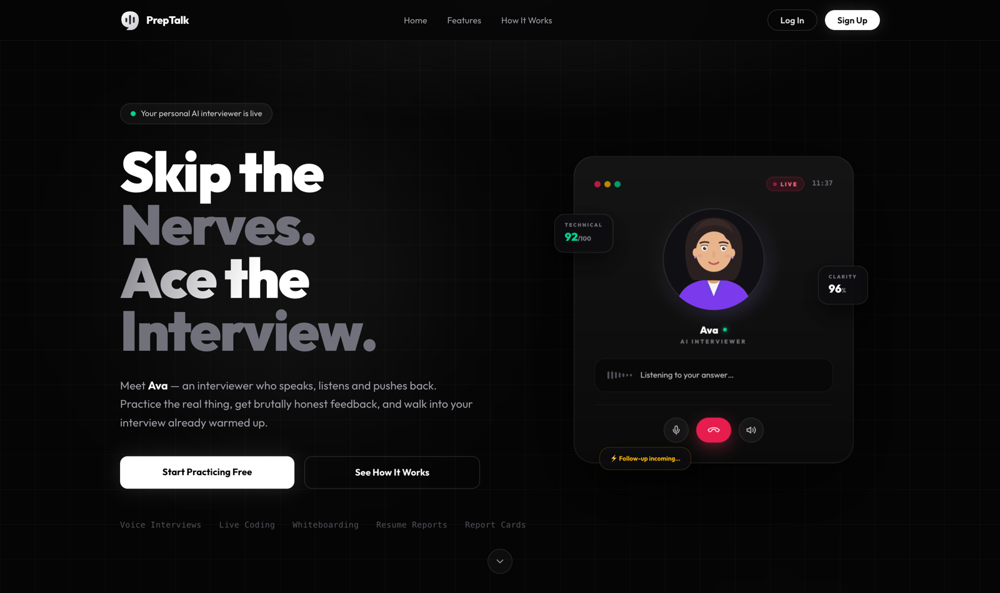
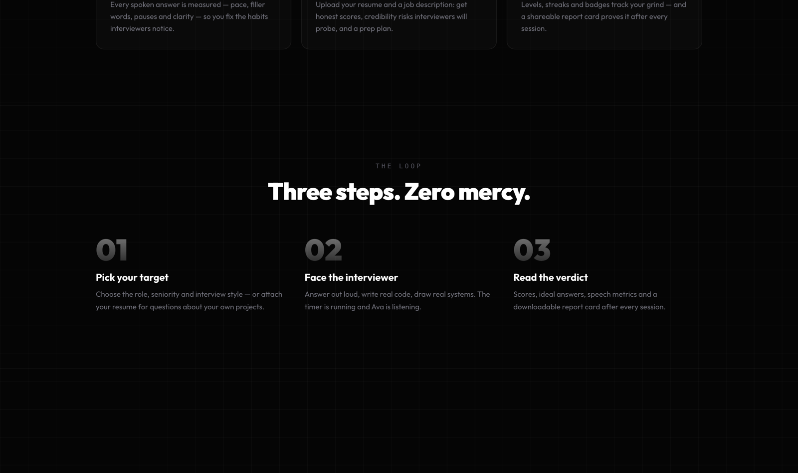
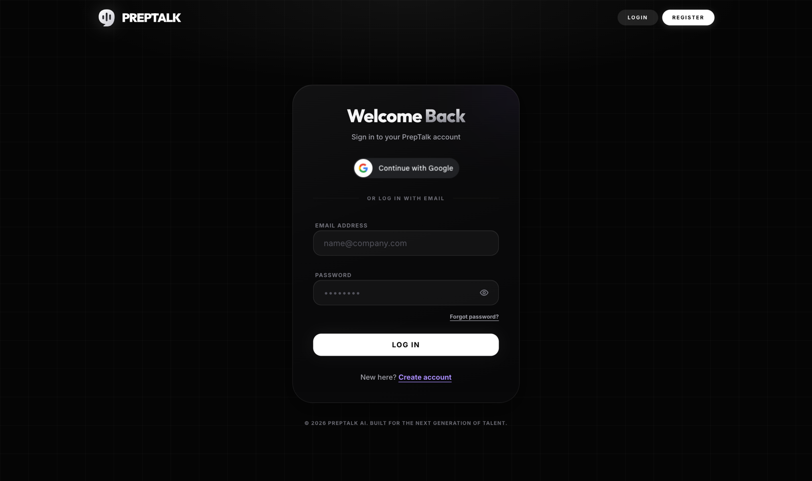
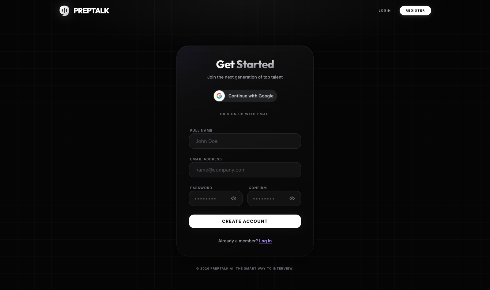
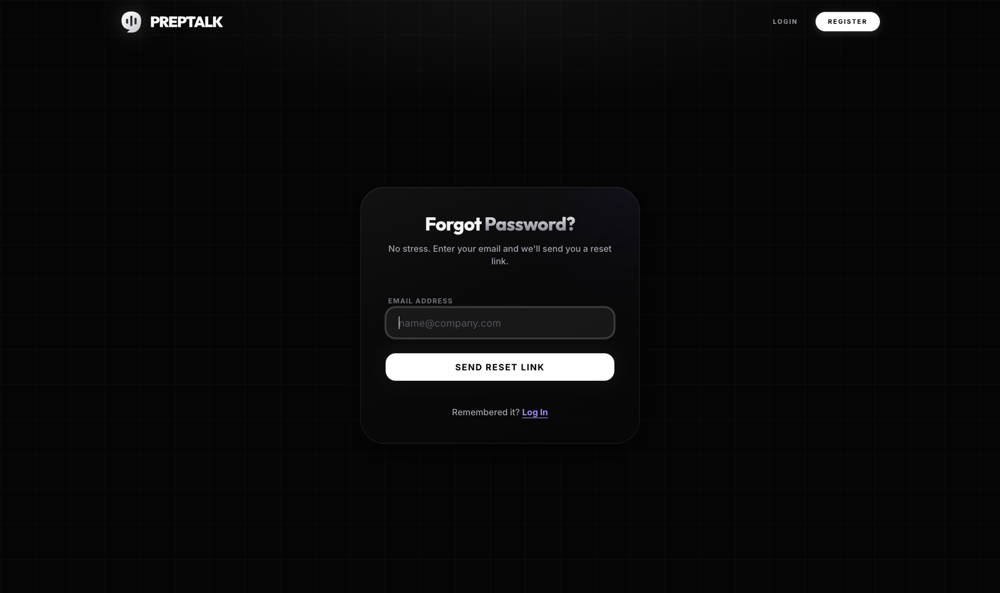
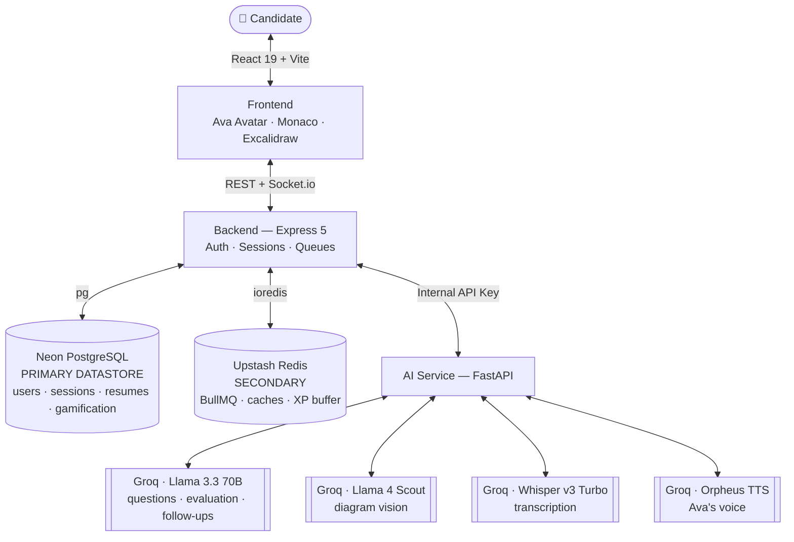

# TechVera — Evidence-Grounded AI Technical Interview Coach

> Phase 1 stable baseline of the upstream PrepTalk application. Evidence grounding remains the project direction; retrieval, provenance, and calibrated evaluator confidence are not implemented. See [architecture](ARCHITECTURE.md), [setup and verification](SETUP.md), and [baseline decisions](docs/decisions.md). Upstream licensing and contributor attribution are preserved.

> **Skip the Nerves. Ace the Interview.**

TechVera is a **voice-first AI mock interview platform**. You sit across from **Ava** — an animated AI interviewer who *speaks her questions out loud* (lip-synced to real TTS audio), listens to your spoken answers, **cross-questions you when your answer is weak**, runs your code live, reads your system-design diagrams, and hands you a shareable **Report Card PDF** at the end.

Built end-to-end on **Groq** (Llama 3.3 70B + Llama 4 Scout Vision + Whisper v3 Turbo + Orpheus TTS) with **Google Gemini** as an automatic resume-analyzer fallback, and a fully serverless data tier — **Neon PostgreSQL** as the primary database and **Upstash Redis** for queues, caches and the leaderboard buffer. The same stack also supports disposable local PostgreSQL/Redis fixtures.

> 📖 **[SETUP.md](./SETUP.md)** — local setup &nbsp;·&nbsp; 🏛️ **[ARCHITECTURE.md](./ARCHITECTURE.md)** — how it all works &nbsp;·&nbsp; ☁️ **[DEPLOYMENT.md](./DEPLOYMENT.md)** — deploy to Render + Vercel

---

## 📸 Screenshots



| | |
|:---:|:---:|
|  |  |
| *Three steps. Zero mercy.* | *Login — Google or email* |
|  |  |
| *Register — email OTP verification* | *Password reset flow* |

---

## ✨ Features

### 🗣️ Ava — The Talking AI Interviewer
- Animated female interviewer avatar with **real-time lip-sync** — her mouth moves with the actual amplitude of the speech audio (WebAudio `AnalyserNode`), plus idle blinking, breathing sway, and eyebrow raises while speaking
- Questions are spoken aloud via **Groq Orpheus TTS** (natural "autumn" voice); automatic fallback to browser `speechSynthesis` if TTS is unavailable
- Replay 🔊 and mute controls; mute preference persists across sessions. Ava shows ready, voice preparation, speaking, recording/listening, processing, retry, and completed states.
- TTS is served **server-side by question index** — clients can never synthesize arbitrary text through your Groq quota

### 🔁 Cross-Questioning (Follow-up Probes)
- Score below 60 on a question? Ava generates a **targeted follow-up** attacking the exact gap in your answer — *"You mentioned X, but what happens when Y?"*
- Follow-ups appear live via WebSocket with an amber **"Follow-up Probe"** badge, capped at 2 per session
- Marked in the session data (`followUpOf`) and in the final report

### 🎯 Role & Resume-Specific Interviews
- Questions tailored to role, seniority, interview type (oral-only / coding-mix / company-specific), and optionally **your uploaded resume** — expect deep-dives into your own projects
- Generated live by Groq's Llama 3.3 70B; every session is different

### 💻 Live Interview Terminal
- **Monaco editor** with real code execution via **JDoodle** (20+ languages)
- **Excalidraw whiteboard** for system design — your diagram is uploaded (Cloudinary) and *visually evaluated* by Llama 4 Scout Vision
- Per-question audio recording persisted in **IndexedDB** (survives refreshes)

### 🧠 Intelligent Evaluation + Speech Analytics
- Technical + confidence scores, detailed AI feedback, and ideal answers per question
- **Whisper-powered speech analytics**: speaking pace (WPM), filler words, pauses, clarity score when ffmpeg measurements are available. STT errors release the answer for retry without grading; unavailable metrics are explicitly marked.

### 📄 Report Card PDF
- One-click branded A4 PDF from the session review: overall/technical/confidence scores, speech analytics, per-question breakdown with feedback and follow-up badges — LinkedIn-share-worthy

### 📊 ATS Resume Analyzer
- Upload PDF/DOCX → background BullMQ pipeline → ATS score, skills extraction, strengths/weaknesses, JD matching, streaming live feedback
- AI **bullet-point rewrites** and one-click **tailored cover letters** (streamed token-by-token)

### 🎮 Gamification & Analytics
- XP, levels, daily streaks, 16 unlockable badges (Night Owl, Polyglot, Silver Tongue…)
- Global leaderboard (indexed in Postgres, XP buffered atomically in Redis during interviews)
- Analytics dashboard: score trends over time, performance by role, speech behavior charts

---

## 🏗️ Architecture



**Three services, one serverless data tier:**

| Service | Stack | Responsibility |
|---|---|---|
| `frontend/` | React 19, Vite, TypeScript, Tailwind v4, Redux Toolkit, Framer Motion, Socket.io-client | UI, Ava's avatar + voice playback, code editor, whiteboard, PDF export |
| `backend/` | Node.js, Express 5, pg (Neon), ioredis, BullMQ, Socket.io, JWT (HttpOnly cookies) | Auth (email + Google OAuth), session orchestration, follow-up logic, TTS proxy, resume job queue, gamification |
| `ai-service/` | Python 3.11, FastAPI, Groq API, PyMuPDF, Pytesseract | Question generation, evaluation, follow-ups, TTS, transcription, resume parsing/scoring |

### 🗄️ Data Tier — Neon Postgres (primary) + Upstash Redis (secondary)

**Neon PostgreSQL** holds all durable data. Flexible AI output lives in JSONB columns, relational things get real constraints and indexes. The schema bootstraps itself on first boot (`CREATE TABLE IF NOT EXISTS`) — schema changes still require a reviewed migration strategy.

| Table | Highlights |
|---|---|
| `users` | UNIQUE email + google_id, denormalized XP/level/streak cache |
| `refresh_tokens` | Rotating tokens, expiry-checked in SQL, lazily purged |
| `sessions` | Questions (with evaluations, speech metrics, follow-ups) as JSONB; `(user_id, created_at DESC)` index for dashboard pagination |
| `resumes` | Parsed data / analysis / JD-match reports as JSONB |
| `gamification` | Badges + achievements as JSONB; partial index on `xp DESC WHERE leaderboard_opt_in` → leaderboard is one ORDER BY |

**Upstash Redis** powers the fast-moving parts:

| Key pattern | Purpose |
|---|---|
| `bull:resume-processing:*` | BullMQ background job queue |
| `resume-cache:*` | ML result cache (same file → skip Groq calls) |
| `resume-view:*` | 24h API response cache |
| `user:{id}:xp_buffer` | Atomic XP counter during interviews (flushed to Postgres on completion) |

Concurrent question evaluations are serialized with a **PostgreSQL transaction/advisory lock** so whole-blob writes never lose updates.

---

## 🚀 Getting Started

> 🧭 Prefer a hand-held walkthrough with every variable explained? → **[SETUP.md](./SETUP.md)**

### Prerequisites

| Requirement | Notes |
|---|---|
| **Node.js 20.19+ (20.x)** | backend + frontend |
| **Python 3.11** | ai-service; Docker also provides Python 3.11 |
| **Neon PostgreSQL** | free tier — [console.neon.tech](https://console.neon.tech) |
| **Upstash Redis** | free tier — [console.upstash.com](https://console.upstash.com) |
| **Groq API key** | free tier — [console.groq.com](https://console.groq.com) |
| Gemini API key | *optional* — resume-analyzer fallback when Groq is rate-limited — [aistudio.google.com/apikey](https://aistudio.google.com/apikey) |
| Google OAuth credentials | *optional* — "Login with Google" |
| Gmail App Password | *optional* — OTP + password-reset emails (console fallback in dev) |
| Cloudinary account | *optional* — whiteboard diagrams + profile photos |
| JDoodle credentials | *optional* — live code execution (200 free calls/day) |

> ⚠️ **Groq TTS one-time step:** Ava's natural voice uses `canopylabs/orpheus-v1-english`, which requires a one-click terms acceptance in the [Groq Playground](https://console.groq.com/playground?model=canopylabs%2Forpheus-v1-english) (same account as your API key). Until then, Ava speaks with the browser's built-in voice — everything still works.

### 1. Clone & install

```bash
git clone <your-repo-url> techvera && cd techvera

# Backend
cd backend && npm ci && cd ..

# Frontend
cd frontend && npm ci && cd ..

# AI service
cd ai-service
python3.11 -m venv .venv && source .venv/bin/activate
pip install -r requirements.txt
cd ..
```

### 2. Configure environment

Copy each `.env.example` → `.env` and fill in:

**`backend/.env`**
```env
# Primary datastore — connection string from the Neon console
DATABASE_URL=postgresql://<user>:<password>@<endpoint>-pooler.<region>.aws.neon.tech/neondb?sslmode=require

# Secondary store (queues, caches) — TCP URL from Upstash console ("Redis Connect" → TCP/TLS)
UPSTASH_REDIS_URL=rediss://default:<password>@<endpoint>.upstash.io:6379

FRONTEND_URL=http://localhost:5173
PORT=5001                      # 5000 is squatted by AirPlay on macOS
NODE_ENV=development
JWT_SECRET=<any long random string>
INTERNAL_API_KEY=<any random string — MUST match ai-service>

AI_SERVICE_URL=http://localhost:8000
BACKEND_URL=http://localhost:5001

# Optional integrations (use dummy values to boot without them)
GOOGLE_CLIENT_ID=...
GOOGLE_CLIENT_SECRET=...
JDOODLE_CLIENT_ID=...
JDOODLE_CLIENT_SECRET=...
CLOUDINARY_CLOUD_NAME=...
CLOUDINARY_API_KEY=...
CLOUDINARY_API_SECRET=...

# Email — OTP verification + password reset (leave empty in dev: OTPs print to console)
SMTP_HOST=smtp.gmail.com
SMTP_PORT=465
SMTP_USER=you@gmail.com
SMTP_PASS=<16-char Gmail App Password>
EMAIL_FROM="TechVera <you@gmail.com>"
```

**`ai-service/.env`**
```env
PORT=8000
GROQ_API_KEY=gsk_...
# Failover keys (optional). ⚠️ Only add quota if they're from DIFFERENT Groq
# accounts — same-account keys share one org-level quota.
GROQ_API_KEY_2=
GROQ_API_KEYS=                 # comma-separated extras
GROQ_MODEL=llama-3.3-70b-versatile
GROQ_VISION_MODEL=meta-llama/llama-4-scout-17b-16e-instruct
GROQ_TTS_MODEL=canopylabs/orpheus-v1-english
GROQ_TTS_VOICE=autumn          # female: autumn, diana, hannah · male: austin, daniel, troy
GROQ_MIN_CALL_INTERVAL=1

# Gemini — Resume Analyzer fallback ONLY (voice + interviews stay on Groq).
# Kicks in automatically when ALL Groq keys are rate-limited.
GEMINI_API_KEY=
GEMINI_MODEL=gemini-2.5-flash

NODE_ENV=development
RESUME_CALLBACK_BASE_URL=http://localhost:5001
ALLOWED_ORIGINS=http://localhost:5001,http://localhost:5173
REQUEST_TIMEOUT=60
INTERNAL_API_KEY=<same as backend>
```

**`frontend/.env`**
```env
VITE_API_URL=http://localhost:5001/api
VITE_GOOGLE_CLIENT_ID=<same Google client ID>
```

<details>
<summary><b>Setting up Google OAuth (optional)</b></summary>

1. [console.cloud.google.com](https://console.cloud.google.com) → New Project → **OAuth consent screen** (External; add your email as a test user)
2. **Credentials → Create Credentials → OAuth Client ID → Web application**
3. **Authorized JavaScript origins:** `http://localhost:5173` and `http://localhost`
4. **Authorized redirect URIs:** `http://localhost:5173` (the app uses the popup/token flow, so this is mostly a formality)
5. Copy the Client ID into both `backend/.env` and `frontend/.env`, and the secret into `backend/.env`

</details>

### 3. Run (3 terminals)

```bash
# Terminal 1 — AI service  → http://localhost:8000
cd ai-service && source .venv/bin/activate && python main.py

# Terminal 2 — Backend     → http://localhost:5001
cd backend && npm run dev

# Terminal 3 — Frontend    → http://localhost:5173
cd frontend && npm run dev
```

Open **http://localhost:5173** → register → **Interview Now** → say hi to Ava. 👋

### 4. Verify

```bash
curl http://localhost:5001/health
# {"status":"ok","db":"connected","primary":"neon-postgres","secondary":"upstash-redis"}

curl http://localhost:8000/
# {"message":"TechVera AI Microservice is running (Modular Version)"}
```

---

## 📡 API Overview

Interview and resume user routes require the HttpOnly JWT cookie. Login/registration are public. The resume callback and backend ↔ AI calls require `X-API-Key`.

| Endpoint | Method | Description |
|---|---|---|
| `/api/user/register` · `/login` · `/google` | POST | Auth (bcrypt + JWT + rotating refresh tokens) |
| `/api/user/verify-otp` · `/forgot-password` · `/reset-password` | POST | Email OTP verification + password reset flows |
| `/api/user/avatar` | PUT | Profile photo upload (Cloudinary, face-crop) |
| `/api/sessions` | POST / GET | Create interview (async AI generation) / paginated history |
| `/api/sessions/:id/submit-answer` | POST | Submit audio/code/diagram → transcription → evaluation → possible follow-up |
| `/api/sessions/:id/speak` | POST | **Ava's voice** — WAV audio for a question (server-side text lookup) |
| `/api/sessions/:id/end` | POST | Finish session, compute final scores |
| `/api/resume/upload` | POST | Enqueue resume analysis pipeline (BullMQ) |
| `/api/resume/:id/rewrite` · `/cover-letter` | POST | Streaming AI rewrites / cover letter |
| `/api/analytics` | GET | Aggregated performance + speech + gamification stats |
| `/api/gamification/leaderboard` | GET | Top opted-in users from PostgreSQL |
| `/api/code/execute` | POST | Run code via JDoodle |

**Socket.io events:** `AI_GENERATING` → `QUESTIONS_READY` → `AI_TRANSCRIBING` → `AI_EVALUATING` → `AI_FOLLOWUP` → `FOLLOW_UP_ADDED` → `evaluation completed` → `session completed`, plus `resume:status` for the analyzer pipeline.

---

## 📂 Project Structure

```text
techvera/
├── frontend/
│   └── src/
│       ├── pages/            # Landing, Dashboard, InterviewRunner, SessionReview, ResumeAnalyzer, Analytics
│       ├── components/       # InterviewerAvatar (lip-sync SVG), InterviewerPanel, ReportCardPDF, ...
│       ├── hooks/            # useInterviewerVoice (TTS + amplitude), useInterviewSession, useAudioRecorder
│       └── features/         # Redux slices: auth, session, resume, gamification, analytics
├── backend/
│   ├── models/               # PostgreSQL repositories: User, Session, Resume, Gamification, RefreshToken
│   ├── services/             # sessionService (evaluation + follow-ups), aiService (FastAPI proxy), queue/
│   ├── controllers/ routes/  # REST layer
│   └── config/               # redisConfig (Upstash client), envValidator, achievements
├── ai-service/
│   ├── app/api/              # interview (generate/evaluate/follow-up), speech (analyze/tts), v2/resume
│   ├── app/services/         # groq_service (LLM + TTS), whisper_service, analysis/, matching/, extraction/
│   └── app/prompts.py        # Hardened prompt templates + sanitization
└── render.yaml               # One-click Render deployment blueprint
```

---

## 🧪 Testing & Quality

```bash
cd backend && npm test          # Jest + Supertest
cd frontend && npm test         # Vitest + Testing Library
cd ai-service && pytest         # Pytest (+ ruff / mypy for linting)
```

CI runs the isolated suites plus mandatory lint/type/build checks. See [SETUP.md](SETUP.md#phase-1-verification) for real PostgreSQL/Redis verification and the Python 3.11 container. Provider fixtures verify contracts and failure handling, not AI scoring quality.

---

## ☁️ Deployment

- **Frontend** → Vercel (set `VITE_API_URL`, `VITE_GOOGLE_CLIENT_ID`)
- **Backend + AI service** → Render via [`render.yaml`](./render.yaml) (Docker blueprints included; fill env vars in the Render UI)
- **Data tier** → the same Neon Postgres + Upstash Redis work from anywhere (both serverless, TLS)
- Remember to add your production URLs to Google OAuth origins and `ALLOWED_ORIGINS`

See [DEPLOYMENT.md](./DEPLOYMENT.md) for the step-by-step walkthrough.

---

## 🔧 Troubleshooting

| Problem | Fix |
|---|---|
| `EADDRINUSE :::5000` on macOS | AirPlay Receiver owns port 5000 — this project defaults to **5001** (or disable AirPlay Receiver in System Settings) |
| `ImportError: find_loader` from pytesseract | You're on Python 3.13/3.14 — needs `pytesseract>=0.3.13` (already pinned in `requirements.txt`) |
| Ava speaks with a robotic browser voice | Accept the Orpheus TTS terms in the [Groq Playground](https://console.groq.com/playground?model=canopylabs%2Forpheus-v1-english) with the API key's account |
| `model_terms_required` from Groq | Same as above — must be accepted by the **org that owns the key** |
| Google popup shows `origin_mismatch` | Add `http://localhost:5173` (no trailing slash) to Authorized JavaScript origins; wait ~5 min |
| OCR fails on scanned/image PDFs | `brew install tesseract poppler` (only needed for image-based resumes) |
| Redis connection refused | Use the **TCP** `rediss://` URL from Upstash (not the REST URL); the REST token doubles as the password |
| Postgres SSL errors | Keep `sslmode=require` in the Neon URL; the app already sets TLS on the pool |

---

## 🛠️ Tech Stack Summary

**Frontend:** React 19 · Vite · TypeScript · Tailwind CSS v4 · Redux Toolkit · Framer Motion · Monaco Editor · Excalidraw · Socket.io-client · React-PDF · Chart.js · WebAudio API

**Backend:** Node.js · Express 5 · **Neon PostgreSQL (primary)** · **Upstash Redis (queues/cache)** · pg · ioredis · BullMQ · Socket.io · JWT · bcrypt · Cloudinary · Multer · Winston

**AI Service:** Python · FastAPI · **Groq** (Llama 3.3 70B, Llama 4 Scout Vision, Whisper v3 Turbo, Orpheus TTS) · **Gemini** (resume-analyzer fallback) · multi-key failover with smart cooldowns · PyMuPDF · Pytesseract · Pydantic

---

## 📜 License

MIT — see [LICENSE](./LICENSE).

---

<p align="center">
  <b>TechVera</b> — because reading interview questions is not the same as answering them out loud. 🎙️
</p>
