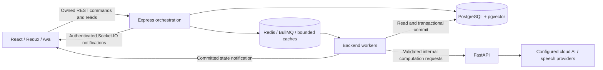

# Target architecture

## CURRENTLY IMPLEMENTED

[ARCHITECTURE.md](../ARCHITECTURE.md) describes the committed Phase 1 runtime:
React/Vite/Redux → Express/TypeScript → FastAPI, PostgreSQL JSONB sessions, Redis
caches/XP and BullMQ resume jobs, REST and authenticated Socket.IO updates. Questions
and scores are generated through prompts. Interview work runs in the API process.
Phase 3 supplies versioned migrations, taxonomy and preparatory knowledge, rubric,
plan, evidence, embedding-metadata and operation/outbox tables. Phase 6 consumes Phase 5 retrieval for persisted deterministic question selection and preview/confirmation, described below. Confirmed originals use the existing runner; no durable interview jobs or new rubric/confidence computation exist. Reload reads an
owned session over REST; current events have no durable revision/replay protocol.
See [database schema](database-schema.md) and [migration policy](migrations.md).
No Phase 3 user-facing behavior change; schema is preparatory.

## PLANNED FOR LATER PHASE: service ownership

The existing three-service architecture remains. Express owns authentication,
authorization, source administration, lifecycle, jobs, and **all durable writes**
through existing PostgreSQL repositories. BullMQ workers extend the backend's
current queue infrastructure. FastAPI performs bounded embedding,
extraction, and evaluation computations and returns validated results; it does
not become a competing session store or a second application backend.

For retrieval, Express applies permission/metadata filters and performs pgvector
queries through a backend repository after FastAPI supplies a versioned query
embedding. It sends the selected bounded evidence to FastAPI. Python does not need
direct database credentials. Redis carries jobs and disposable caches, never the
only copy of a plan, rubric, evaluation, or evidence trace. Deployment can initially
run the worker with the backend; a separate process uses the same code and contracts.



Phase 2 supplied this design without implementation. Phase 3 implements its schema
foundation; no interview worker or candidate-facing intelligence endpoint is enabled.
Phase 5 enables pgvector and an authenticated internal embedding endpoint.

## Target lifecycle and recovery

| Stage | Synchronous boundary | Asynchronous work | Persisted authority / recovery | Ava and frontend |
|---|---|---|---|---|
| Setup | Validate owned resume, role/junior/topics/mode/count/time and consent; create session and job intent | None required before acknowledgement | Setup snapshot, request idempotency key, session revision | Idle → preparing; REST acknowledgement |
| Plan/select | Return pending state; accept no answers yet | Embed/filter/retrieve, deterministic planner, optional grounded generation; validate complete plan | Versioned plan/items, retrieval trace and job attempt; recover expired lease | Preparing, honest availability/shortage message |
| Question ready | Fetch committed question and request server-selected TTS | TTS generation if available | Active item/version; voice failure never changes question | Speaking or text/browser-voice fallback, then ready |
| Answer | Validate ownership/item/state/idempotency; stage bounded upload and claim attempt | STT if audio, text/code/diagram extraction, optional bounded execution checks | Immutable answer attempt and artifact references; status/revision/job intent | Listening only during recording → thinking/evaluating |
| Evaluation | Read status; no speculative score | Match evidence to pinned concepts, evaluate/validate rubric, apply confidence/abstention rules | Evaluation/version/evidence committed together; retry same attempt without duplicate grade | Processing; error/retry on failure |
| Probe/advance | Commit policy decision and claim next turn | Generate supported gap probe if justified, or select next planned item | Parent item ID, reservation/attempt, updated plan revision and rationale | Follow-up → speaking, or transitioning |
| Complete | Refuse active work; idempotently mark finishing | Build report from committed evaluations, not a new unbounded LLM grading pass | Report snapshot/scoring version; transactionally complete and reward once | Completed after report ready; retry report separately |

Target operation states are `queued`, `running`, `succeeded`, `retryable_failed`,
and `terminal_failed`; answer states distinguish received/transcribing/evaluating/
evaluated/abstained. These supplement existing session states, not immediate enum
changes. Operation records need attempt number, lease expiry, deadline, payload
hash, error code and committed revision. A recovery scan re-enqueues expired work
with bounded retries (initial proposal: two transient retries, then visible retry).
Permanent validation/no-evidence failures are not retried as provider failures.

The later persistence design must add a transactional job/event outbox: SQL commits
the state and dispatch intent together; a dispatcher retries publication to Redis.
Workers use stable operation IDs, claim/check revision under the existing advisory
lock, release locks for provider calls, then reject stale/cancelled results before
committing. Provider invocation may repeat; durable effects must be idempotent.
Question XP also needs a SQL ledger/outbox policy before claiming crash-safe rewards.
Recovery must cover staged media expiry, cancelled/deleted sessions, and duplicate
callbacks. These are Phase 8 integration requirements, with schema prerequisites
reviewed in Phase 3; they are not guarantees of today's in-process baseline.

## REST, Socket.IO, and compatibility

REST remains authoritative for create, owned snapshot/history, answer submission,
finish/delete, server-selected TTS, report, and source/evidence reads. Socket.IO
continues to deliver progress in authenticated per-user rooms; it is a notification
channel rather than an alternative command protocol or transport for audio blobs.
The target event envelope contains `sessionId`, `revision`, `operationId`, `eventId`,
`state`, and a safe progress/error code. Clients ignore older revisions and fetch
REST on reconnect, revision gaps, and timeout. A missed socket event cannot lose
the only copy of a result. Multi-instance fan-out must be validated in Phase 8.

Future contracts use a `contractVersion` and add stable item/question-version IDs;
legacy indexed sessions remain readable. The current create response remains 201
with `sessionId`/`processing`; additional plan/evidence reads are additive, with
paths finalized during implementation. A target evaluation exposes `rubricId`,
`rubricVersion`, `rubricStatus`, `scoreStatus`, nullable `technicalScore`, dimensions,
concept evidence, `evaluatorConfidence`, reasons, and `delivery` separately. No
current `confidence_score` is renamed into evaluator confidence. Historical
equal-weight results are labeled legacy scoring, not retroactively reinterpreted.

## Question categories and answer evidence

All six target categories require a recorded origin and provenance availability.
For generated/no-evidence items that means explicit absence, not invented citations.
Ava presents every category and can speak instructions; candidates may mute voice
or use typed input. Text alternatives are required for the FYP.

| Category | Candidate input / expected evidence | Evaluation | Deterministic checks | LLM role |
|---|---|---|---|---|
| `conceptual-oral` | Audio/transcript or text; definitions, examples, limitations | Reviewed/provisional concepts and reasoning | Input validity; no keyword-only correctness score | Required for semantic evidence mapping in initial design |
| `scenario` | Spoken/typed diagnosis or decision with assumptions | Correct consequences and justified reasoning | Known invariant/structured fact checks when authored | Required for open reasoning |
| `coding` | Code, selected language, explanation; useful cases and complexity | Test evidence plus implementation/reasoning rubric | Authored bounded test cases through existing execution integration when supported | Needed for reasoning/coverage; not for factual test outcomes |
| `debugging` | Patch or spoken/text diagnosis, reproduction and fix | Causal diagnosis, repair, regression reasoning | Authored reproducer/tests for executable tasks | Needed for diagnosis/explanation |
| `sql` | Query plus optional explanation over a fixed provided schema | Result semantics including duplicates/NULL, query reasoning | Reviewed query fixtures when a bounded execution path is available; dialect parsing alone is insufficient | Needed for explanation or unavailable execution |
| `system-design-lite` | Existing whiteboard plus spoken/text component/data-flow explanation | Requirements, data/API correctness, feasible trade-offs | Structured required-element checks; no aesthetic score | Needed for explanation/diagram interpretation; abstain if artifact unreadable |

Python/JavaScript execution uses the existing JDoodle boundary; there is no local
arbitrary-code executor. SQL execution remains capability-gated until a bounded
adapter is tested in a later phase; no new database executor is approved here.
Missing execution evidence is marked unavailable, never “tests passed.” Vision
output must cite candidate-described elements; an unclear image triggers a text
clarification/retry rather than confident evaluation. Current kinds `oral`,
`coding`, `system-design` remain compatibility families; categories are future
subtypes, not a Phase 2 change to their enums.

### Origin and provenance contract

`origin` is one of `retrieved`, `generated`, `adapted`, `fallback`, `follow-up`.
It is independent of category, delivery kind, and rubric status.

| Origin | Required lineage |
|---|---|
| Retrieved | Approved stored question/version ID, source document/chunk links, retrieval ID and selection reason; locally authored questions cite their editorial source |
| Generated | Model/prompt version, generation operation, technical grounding links or explicit `evidenceStatus: unavailable`; generation is not a source |
| Adapted | Base question/version, transformation summary, model/editor version and retained source links; changed expected concepts require a new provisional rubric pending review |
| Fallback | Selection failure reason, deterministic template/reviewed seed ID/version, and any source links; a reviewed unchanged seed may retain a known rubric |
| Follow-up | Parent plan item/evaluation/concept IDs, probe reason, generation/template version and relevant evidence; no follow-up of a follow-up |

Every item stores creation/selection time, content hash, taxonomy/difficulty,
rubric reference, source IDs and exact versions. Mixed operations preserve base
origin and transformation history rather than overwriting lineage with “AI.”
Evaluation evidence links answer spans/test outcomes to expected-concept IDs and
reference chunk versions. A model's assertion that it used a URL is insufficient;
only retrieved IDs supplied to that operation may be returned as citations.

## Conceptual persistence model

The concepts below were frozen in Phase 2, which supplied no DDL. Phase 3 implements
their relational foundation (including separate document/rubric versions and links)
with backend-owned writes. Computation and human/admin ingestion/review workflows
remain future behavior. See [the concrete model](database-schema.md).

| Entity | Purpose / relationships | Lifecycle / versioning |
|---|---|---|
| `competencies` | Root/child hierarchy referenced by questions, concepts, plans | Reviewed taxonomy releases; deprecate IDs, preserve history |
| `sources` | Permission/licensing/quality policy and adapter configuration | Proposed → approved/rejected → suspended; policy revision and review date |
| `source_documents` | Cleaned, PII-screened content from one source; timestamps/content hash | Quarantined → reviewed/published → superseded/withdrawn; immutable published versions |
| `source_chunks` | Bounded document sections for evidence and vectors | Versioned chunker/offset/hash and document version; retire on withdrawal |
| `interview_questions` | Stable question identity and primary competency | Draft → active → retired; points to published versions |
| `question_versions` | Immutable text/category/difficulty/origin/lineage | Review/publish before known use; adaptations create new versions |
| `expected_concepts` | Observable expected facts/reasoning with reference links | Versioned within rubric; reviewed or provisional; never mutable historical anchors |
| `rubrics` | Applicable dimensions/weights/anchors, concepts, review status | Draft/provisional → reviewed → retired; question-version and scoring-policy linkage |
| `interview_plans` | Owned session setup, coverage, budget and selection snapshot | Building → ready → active → completed/failed; revisions and planner version |
| `plan_items` | Ordered question-version/rubric selections and parent probe links | Planned → active → answered/skipped; stable IDs and revision-checked adaptations |
| `retrieval_evidence` | Query/filter/model/corpus snapshot and ranked chunk/question hits | Immutable per retrieval operation; redacted query, selection/fallback reason |
| `evaluations` | Owned answer-attempt grade/abstention, confidence, pinned versions | Pending → succeeded/abstained/failed; reevaluation is a linked new revision |
| `evaluation_evidence` | Answer spans, test outputs, concept judgments and source/chunk support | Immutable with evaluation; invalidated/redacted on deletion/withdrawal as required |

Additional prerequisites for Phase 3 review: answer attempts and media references,
embedding records, operation/lease records, outbox dispatch, and reward deduplication
records. They are supporting durability concepts, not another datastore. Embeddings
link chunk/question version, model, dimension, normalization, content hash and status.

Existing users, refresh tokens, resumes, gamification and session identity/ownership
remain relational. `sessions.questions` JSONB retains legacy sessions and becomes a
compatible **projection/snapshot** for newer sessions, with stable plan/evaluation
references. Durable searchable questions, sources, versions, plans, and evaluation
evidence become relational authority. Variable provider diagnostics, dimension
payloads, and rendered report snapshots may remain bounded JSONB within those
records; they do not replace constrained relationships. Writes to relational
authority and the session projection commit together. Reports read pinned versions;
later edits cannot silently change an old interview. A migration/backfill strategy
must be reviewed in Phase 3, rather than blindly assigning provenance to legacy data.

## Permitted ingestion boundary

Ingestion runs as scheduled/admin jobs, never inline unrestricted browsing in an
interview. Adapters initially cover locally authored/reviewed files, explicitly
licensed technical references with recorded redistribution rights, permitted APIs
or feeds, and voluntary candidate experience submissions with consent. Each adapter
declares allowed origins, authentication, rate/size limits, permission evidence,
terms/license revision, attribution, refresh policy and withdrawal handling.
Public accessibility alone is not permission. No prohibited LinkedIn scraping,
paywall/login bypass, leaked employer bank, or confidential take-home task is used.

Pipeline: validate source permission → quarantine raw input with bounded retention
→ strip markup/navigation → detect/redact PII and confidential details → normalize
→ content-hash exact dedupe → near-duplicate cluster/review → map taxonomy/difficulty
→ extract candidate questions/concepts → human quality/license review → publish
versioned documents/chunks/questions. Model extraction cannot approve its own rubric.
Approved technical references and unverified interview experiences have different
quality classes: experiences can inform question selection but cannot establish
technical correctness by themselves. Rejected items record reason/hash/adapter
metadata without retaining prohibited content unnecessarily.

Record interview occurrence, publication, fetch, review, and last verification as
separate timestamps, with unknown dates explicitly null. Preserve duplicate-source
lineage while selecting one canonical item. Recently fetched evergreen documentation
does not become recent interview intelligence. Conflicting or withdrawn content is
excluded from new selection; historical reports show withdrawal and redact content
when rights require it. See [privacy requirements](data-and-privacy.md).

All retrieved text, resumes, JD text and answers are untrusted data. Separate them
from system instructions, restrict context size, validate outputs/IDs and disable
tool execution from their content. Quarantine suspicious content and test injection
attempts; regex stripping is not a complete defense. Server fetch adapters require
reviewed destination/redirect/DNS controls, including the baseline's known IP-pinning
gap, before activation.

## PostgreSQL + pgvector retrieval

Embed approved cleaned chunks and published question text with competency metadata;
exclude raw resumes, audio and candidate answers from the shared index. Store model
identifier/revision, dimension, normalization, embedding version, chunker version,
content hash and creation time. One query uses one compatible model/dimension/corpus
version. Re-embedding creates a staged version; an atomic active-version switch
prevents mixed spaces. Phase 5 selected pinned local L3 MiniLM / 384d / mean-L2 from the development
benchmark, with exact filtered pgvector search and no ANN index. See the implemented
[retrieval contract](retrieval.md), which supersedes planned retrieval details here.

Retrieve in two channels: interview-experience/question candidates for selection,
and reviewed technical-reference chunks for generation/evaluation. Apply approved
source/access status, role compatibility, selected child/root, junior level,
requested difficulty and date/company requirements **before** similarity ranking.
Use cosine similarity and a configurable minimum threshold calibrated on relevance
judgments; similarity is not a confidence probability. Begin with exact search for
a small corpus; choose approximate indexes only after recall measurements.

Retrieve a bounded candidate pool (initial target 20), collapse exact/near-duplicate
clusters and already-selected question families, then retain up to five useful
hits. Return IDs/versions, permitted excerpts, source title/link/license, quality,
timestamps, filter snapshot, rank/similarity, model/corpus version and exclusion
reasons. Similarity alone cannot override licensing, role, or evidence quality.

CURRENTLY IMPLEMENTED Phase 6 planner fallback order: exact filtered retrieval → adjacent junior difficulty with explicit
reason → unchanged reviewed local seed for the selected competency → deterministic
approved template labeled fallback → underfilled plan or setup correction. Phase 6 uses unchanged reviewed seed references as templates and never generates new fallback text. Company/date constraints remain exact; changing them requires an explicit new setup/preview. No acceptable selection evidence means a non-confirmable correction. Legacy evaluation remains separately labeled; grounded scoring/abstention belongs to Phase 7. Retrieval outage and no relevant hits have different reason codes.

Design targets, **not measurements**: warm retrieval p95 ≤1 second including query
embedding; planning p95 ≤5 seconds without generation; grounded generation/evaluation
p95 ≤30 seconds, STT p95 ≤15 seconds for ≤60-second clips. Hard operation deadlines
must fit the existing bounded internal HTTP requests; provider outages return honest
progress/failure and fallback. Phase 10/11 will report cold starts, provider time,
queue wait and hardware separately and revise these targets if evidence warrants.

PLANNED ONLY IF MEASUREMENTS WARRANT: Redis may cache approved public retrieval results for five minutes, keyed by query
hash, complete filters, model and corpus/policy revision. Recheck permission/status
before use and invalidate on withdrawal or version switch. Personalized queries are
session/owner-scoped and excluded from shared caches. Persist the selected retrieval
trace in PostgreSQL even on cache hits. Do not cache candidate evaluation by raw
answer across users. There is no second FAISS persistent store.

## Planner contract and deterministic policy

Inputs: supported role, junior level, selected roots, difficulty, effective duration
and original-question budget, core mode, optional company/track, consented minimal
resume/JD focus, and eligible retrieval availability. Snapshot validated inputs,
planner/scoring/taxonomy versions and corpus revision. The deterministic planner
allocates at least one item to each selected root, then round-robins remaining
coverage with stable tie-breaking by quality, match, similarity and stable version
ID. Desired difficulty mix: 60% requested band and 40% adjacent band; integer counts
use largest remainders, ties prefer requested band then easier band. Easy has
standard as adjacent; standard prefers easy; stretch uses standard. Shortages are
recorded rather than presented as a fulfilled distribution.

Initial estimates: oral/scenario/spoken debugging 3 minutes, coding/executable
debugging 8, SQL 5, design-lite 8; setup/wrap-up 2 minutes, two optional probes
reserve 4 minutes. Decrease count before dropping requested roots; ask for a setup
correction if even one item per root cannot fit. These are planning estimates, not
enforced grading speed limits. Candidate-selected time controls finishing/skip
choices without scoring a slow typist as technically wrong.

Illustrative **future** plan snapshot (IDs are examples, not existing records):

```json
{
  "contractVersion": "plan-v1",
  "planId": "example-plan",
  "revision": 1,
  "plannerVersion": "deterministic-v1",
  "taxonomyVersion": "junior-se-v1",
  "corpusVersion": "example-corpus-v1",
  "role": "Backend Developer",
  "level": "junior",
  "mode": "mixed",
  "modifiers": {"company": null, "resumeContext": false, "jdContext": false},
  "selectedCompetencies": ["dbms-sql", "backend-web", "programming"],
  "originalQuestionCount": 5,
  "coverage": {"dbms-sql": 2, "backend-web": 2, "programming": 1},
  "difficultyDistribution": {"easy": 3, "standard": 2, "stretch": 0},
  "sections": [
    {"competency": "dbms-sql", "itemIds": ["i1", "i2"]},
    {"competency": "backend-web", "itemIds": ["i3", "i4"]},
    {"competency": "programming", "itemIds": ["i5"]}
  ],
  "items": [
    {"id": "i1", "questionVersionId": "qv1", "rubricVersionId": "rv1", "category": "conceptual-oral", "difficulty": "easy", "origin": "retrieved", "retrievalEvidenceId": "re1", "sourceIds": ["s1"], "selectionReason": "exact_match", "minutes": 3},
    {"id": "i2", "questionVersionId": "qv2", "rubricVersionId": "rv2", "category": "scenario", "difficulty": "standard", "origin": "retrieved", "retrievalEvidenceId": "re1", "sourceIds": ["s1"], "selectionReason": "coverage", "minutes": 3},
    {"id": "i3", "questionVersionId": "qv3", "rubricVersionId": "rv3", "category": "conceptual-oral", "difficulty": "easy", "origin": "retrieved", "retrievalEvidenceId": "re2", "sourceIds": ["s2"], "selectionReason": "exact_match", "minutes": 3},
    {"id": "i4", "questionVersionId": "qv4", "rubricVersionId": "rv4", "category": "scenario", "difficulty": "standard", "origin": "fallback", "retrievalEvidenceId": "re2", "sourceIds": ["s2"], "selectionReason": "reviewed_seed_after_shortage", "minutes": 3},
    {"id": "i5", "questionVersionId": "qv5", "rubricVersionId": "rv5", "category": "coding", "difficulty": "easy", "origin": "retrieved", "retrievalEvidenceId": "re3", "sourceIds": ["s3"], "selectionReason": "coding_coverage", "minutes": 8}
  ],
  "timeBudget": {"availableMinutes": 30, "originalMinutes": 20, "setupWrapMinutes": 2, "probeReserveMinutes": 4, "slackMinutes": 4},
  "adaptation": {"maxFollowUps": 2, "maxPerOriginal": 1, "recursive": false, "maxProbeMinutes": 2, "replaceUnaskedOnly": true}
}
```

Plan invariants: all selected versions exist and are permitted; original count,
coverage counts, item IDs and difficulty counts agree; no repeated family; total
reserved minutes fit duration. No score has been produced at planning time.
Unavailable sources produce a persisted shortage/fallback reason and shown coverage.

Adaptation targets one supported missing concept or contradiction in a substantive
answer with adequate evidence, within the probe reserve. Low evaluator confidence,
failed transcription, or missing artifacts trigger clarification/retry, not a
punitive probe. Follow-ups cannot reveal ideal answers or recursively probe; retain
the existing two-per-session cap with stable parent IDs. Original and clarified
performance remain separate. Only unasked items may be replaced, preserving selected
coverage and budget, recording a new revision/reason. An LLM may suggest a probe,
but cannot rewrite the plan or validated selection constraints on its own.

## Frontend and Ava direction

Setup shows three roles, junior level, 1–4 competencies, difficulty, core mode,
time/count and language where relevant. Company, resume and JD are optional toggles
with permission/consent and availability messages. Show planned coverage, effective
count and estimates before starting; a resume cannot silently enable a different mode.

| Ava state | Meaning / controls |
|---|---|
| Idle | Setup/ready; no claim that microphone is active |
| Preparing | Plan or question voice pending; readable text and cancellation |
| Speaking | Actual playback; replay/mute and stop-on-recording |
| Listening | Only while microphone is recording; visible indicator and typed alternative |
| Thinking/evaluating | Accepted answer work pending; no guessed score or listening animation |
| Follow-up | Clearly labeled probe linked to original item; no ideal-answer hint |
| Transitioning | Moving to committed next item; no duplicate submit/playback |
| Completed | Read-only interview, report/export and next practice choice |
| Error/retry | Explain operation failure, retain safe draft, retry or skip when allowed |

Ava remains the SVG interviewer. It asks neutral technical questions, supports
muting/text fallback, and describes actual progress. It does not infer emotions,
promise correctness, flatter, expose reference answers mid-interview, or judge
accent/personality. Functional behavior is integrated per phase; no Phase 2 UI edit.

During interviews show item/category, coverage progress, processing state, retry,
artifact/test availability and provisional status. Hide scores, missing concepts,
expected answers, and diagnostic test details until completion; basic editor syntax
and candidate-run output remain visible. Record runs as assistance evidence. A
provenance badge may say reviewed/reported/generated/fallback; full excerpts and
source answers appear after completion to avoid leakage. Coding uses Monaco plus
explanation; design-lite uses Excalidraw plus required text/audio explanation.

Reports show eligible overall performance with coverage counts, reviewed competency
breakdown, question-level dimensions/concept spans, missing concepts, confidence
and abstention reasons, separate delivery measurements, source provenance and dates,
provisional suggestions, original/probe distinctions, and evidence-based study
priorities. PDF and UI use the same persisted report snapshot. Never present an
unassessed competency or processing failure as a zero score. Full semantics are in
[evaluation design](evaluation-design.md).

## Reference ideas and boundaries

Technical Interviewer's `backend/app/agents/planning_agent.py`,
`backend/app/core/question_selector.py`, and `backend/app/rag/retriever.py` were
studied read-only. Useful ideas are explicit sections/budgets, stable exclusions,
adjacent-difficulty fallback, bounded source-bearing retrieval, and missing-index
degradation. TechVera replaces role presets with junior competencies, empty-hit
ambiguity with explicit reasons, filesystem/FAISS storage with PostgreSQL, and
reference-native state with Express-owned REST/Socket.IO/SQL. No source files,
assets, eight-metric rubric, SQLite/ORM, or 3D/voice stack were copied. Existing
licenses/attribution remain; any later code/asset adaptation needs its own review.

## Phase 4 ingestion implementation boundary

CURRENTLY IMPLEMENTED: backend-owned local-file adapter/CLI, exact permission
hashes, deterministic normalization/screening/structured extraction, explicit human
review, versioned publication/withdrawal, consented experience-record path and a
48-question original corpus with actual review. [Ingestion](ingestion.md) documents
limits, audit/expiry and deferred HTTP/public submissions. [Corpus manifest](corpus-manifest.md)
distinguishes real reviewed artifacts/disposable imports from fictional test data.

No candidate-facing Phase 4 behavior; reviewed corpus is preparatory for Phase 5/6.

Planner selection and preview/confirmation are now implemented in Phase 6. Scoring and durable runtime integration remain PLANNED FOR LATER PHASE.
Phase 5 retrieval is implemented internally and consumed by Phase 6 selection. No new model extraction or concept/rubric engine is activated. Backend owns every durable ingestion write; FastAPI has
no new database access. Phase 2 remains the architecture source of truth.


## Phase 5 implementation boundary

CURRENTLY IMPLEMENTED: backend-owned reviewed-corpus jobs, active/staged compatible
spaces, two internal retrieval channels, complete filters/provenance/evidence,
deduplication and immediate withdrawal checks, pinned FastAPI CPU embeddings and
measured development benchmarks. Retrieval caching is deferred pending measured
benefit; no ANN index is justified for this corpus size.
Technical-reference corpus count is zero. Query hashes are stored without raw text.

No live interview behavior change in Phase 5; retrieval is ready for the Phase 6 planner.

## Phase 6 implementation boundary

CURRENTLY IMPLEMENTED: Express deterministic planner→owned relational preview→confirmed server-selected JSONB originals→existing runner. FastAPI supplies embeddings and legacy AI computations; PostgreSQL owns all plan/retrieval writes. Frontend functional setup/preview and truthful planning states ship with this phase. Current score/report/follow-up behavior remains legacy; reviewed rubrics, evaluator confidence, durable operations and final avatar redesign remain later work. See [planner](interview-planner.md) for exact policies and compatibility. The service ownership/design above remains the frozen target; it does not claim future execution exists.
